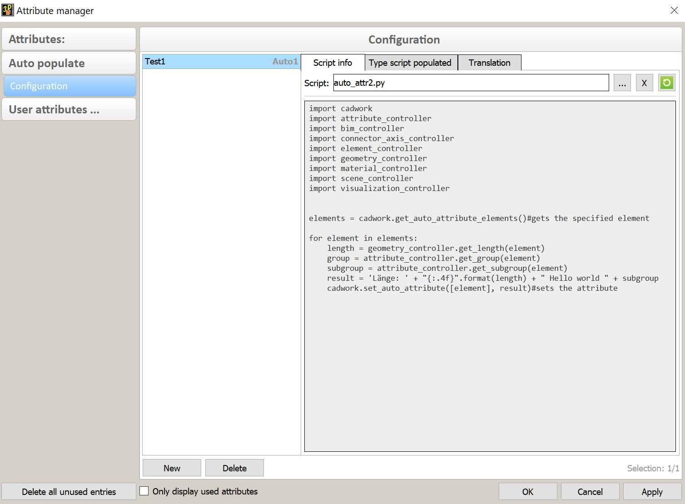
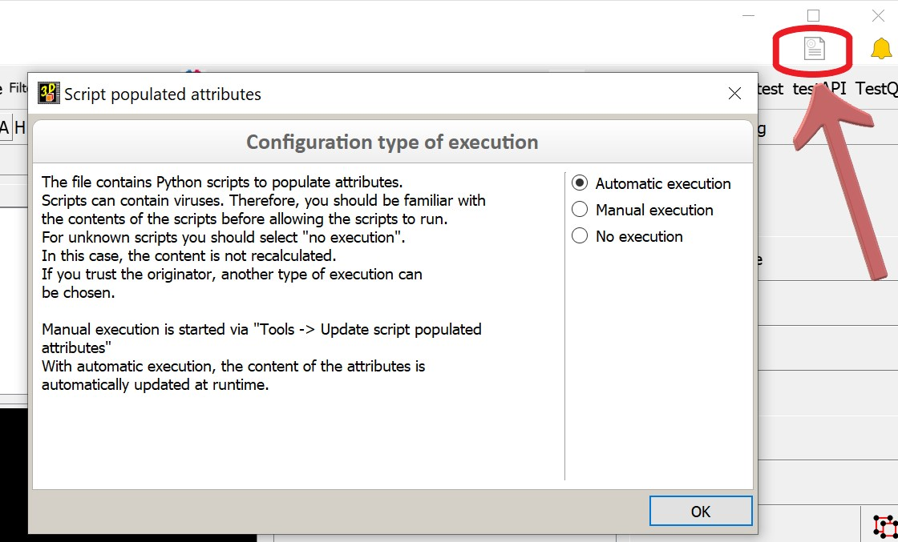

# Auto Attributes

## Script filled attributes
Each component in cadwork is described geometrically and with regard to its position in the 
entire construction project. On the other hand there is an almost unlimited number 
of further attributes is available. Some of these attributes like color, material, name, 
building (building) and storey (storey) have to be set during the generation of the component. 
during the generation of the component. Others are optionally available to the user. Each of these 
attributes are explicitly defined by the user by setting them via Modify.
Attributes are used to fully describe the part properties. 

Furthermore, they are used for the creation of a suitable structure of the construction project 
and for the transfer of specific information to downstream systems such as an 
such as an ERP system.

Often, the content of an attribute is dependent on the content of other attributes or even 
geometric information. In this case, it is tedious to define the content manually. 
manually. For this reason cadwork provides in version 29 attributes which can 
which calculate their content independently with the help of a script at runtime. 
These are the so-called script-filled attributes. As script language Python 
is used. The Python script has access to various properties of the parts via the cadwork API. 
of the parts. These can be evaluated in the script and the content of the attribute 
can be calculated.

In contrast to all previous attributes, the content of a script-filled 
attribute is not defined manually by the user. The task of the user is to create a 
Python script, which on the basis of other element properties (geometry and attributes) to calculate the content of the script-filled attribute. The 
calculated content is displayed as for all other attributes (Modify, 
info window, plan outputs), can be used for activating/deactivating as well as showing/hiding 
can be used for activating/deactivating and hiding, can be used as a comparison and sorting criterion for the 
list calculation and is exported to the different lists. 
The only difference to the known attributes is the automated generation of the 
content via a Python script.

## Creation of script-filled attributes
These attributes are created similar to the user-defined attributes in the Attributes dialog
(User profile -> Wood... -> Attributes) in the new Script Filled -> Configuration tab.

{: style="width:700px"}


A created script-filled attribute is available for any 
for each element type in the 
cadwork. In the tab Type 
script-filled tab the evaluation of the 
script can be limited to single element types. 
element types. The 
can be useful if, for example 
different evaluations are required for plates 
and members are required. If the 
evaluation is intended only for elements of the type member, the content of this 
attribute remains empty for all other element types. If the element type is subsequently changed 
element type, a recalculation of the attributes is triggered.

## execution status
The execution status of the scripts can be controlled.
The icon for configuring the script-filled attributes is visualized in the Windows menu bar to the left of the message center icon. This display hides a button that can be used to subsequently change the selected status. 

{: style="width:700px"}

## example code
```python
import cadwork
import attribute_controller
import geometry_controller

elements = cadwork.get_auto_attribute_elements()#gets the specified element

for element in elements:
    length = geometry_controller.get_length(element)
    group = attribute_controller.get_group(element)
    result = ' Group:' + group + 'Length:' + str(length)
    cadwork.set_auto_attribute([element], result)#sets the attribute
```

<noscript>
    
</noscript>
<script defer src="https://analytics.cadwork.ca/ingress/e6b1702b-6224-4e93-94b7-9e4c2cd7ae06/script.js"></script>